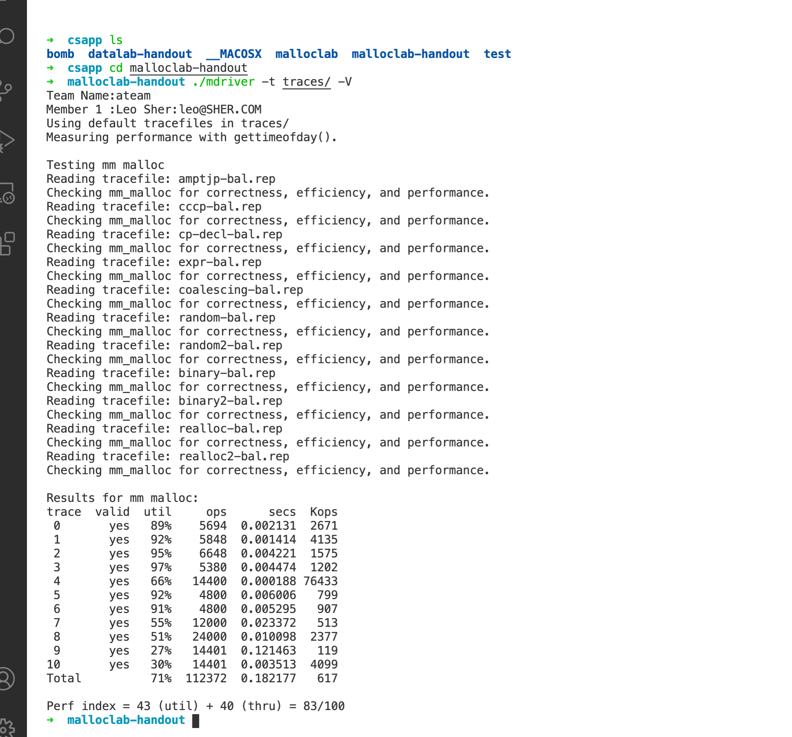

# 天问之路第二周学习情况

这周主要还是把编程的一些内容完成了编程的工作

到现在为止就只剩下了两个安全相关的实验以及其他的一些收尾没有做了

## malloc lab

实验主要是按照课本上的代码进行修改的(所有的宏以及全局变量和隐式链表均按照课本示例完成),一开始采用的Next_Fit可以达到80+,然后挨个trace文件进行测试寻找瓶颈的时候发现realloc偏低,只有24分,于是在网上寻找资料https://www.bilibili.com/video/BV1iW411d7hd?from=search&seid=2745343114147940763,这个课里老师建议不再使用footer,但是采用了这个方法之后,对realloc重新进行算分,发现还是24分emmmmm...不过总分也达到了83分,群里一些大佬完全自己一点点写的代码,他们如果达到六七十我感觉都比我这个八十多厉害

在其他人的博客上找到了一些仿照glibc的方法,但是没时间修改了只好下周再看看(但其实我更想码一些算法或者数据结构相关的代码)

## proxy lab

实验分为三步,目的就是实现一个可以将内容暂存的代理,每个函数的代码并不特别复杂,只是第一次写的时候心中很难有一个大体的框架(于是我就参考了书上的tiny web server)

前两步学过基本的unix网络编程的话就基本可以做到,第三步比较复杂

### 转发

转发就是解析请求部分,然后再发送到对应的服务器,就是解析处理字符串

### 并发

无论是fork、thread_create、select、poll、epoll、kqueue都可以,使用了最简单的fork模型

### cache功能

和上面的两个相比,有点复杂

采用了LRU策略,然后值得注意的是:**针对缓冲区的操作一定要加锁!!!**

